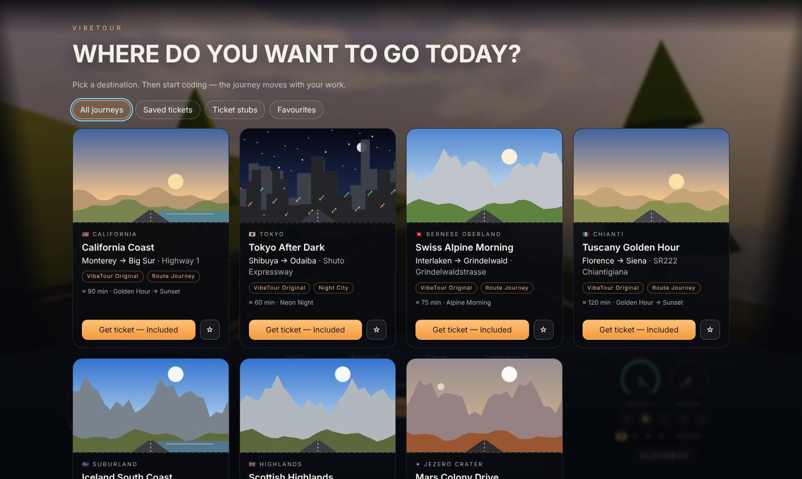
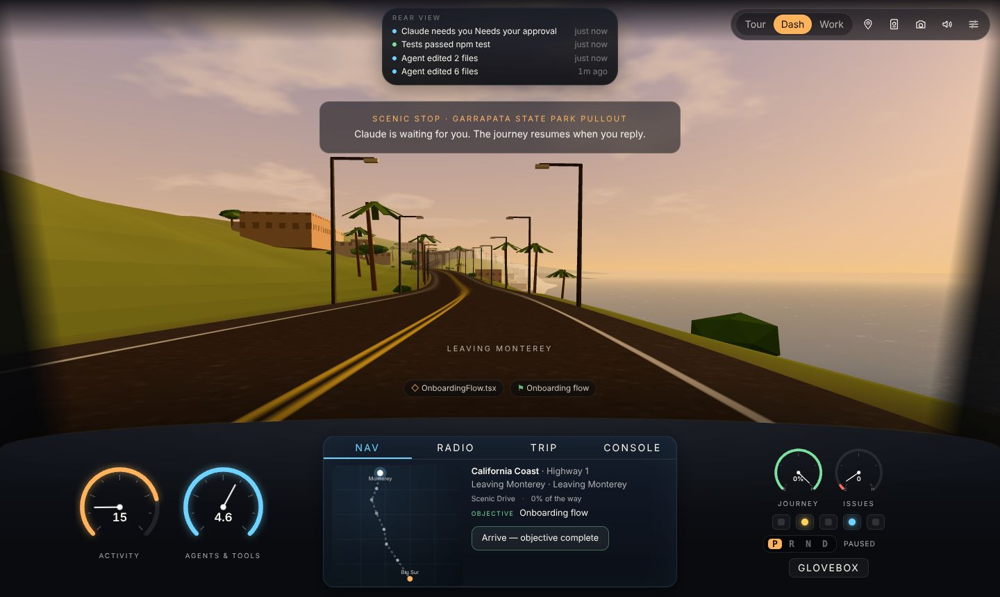
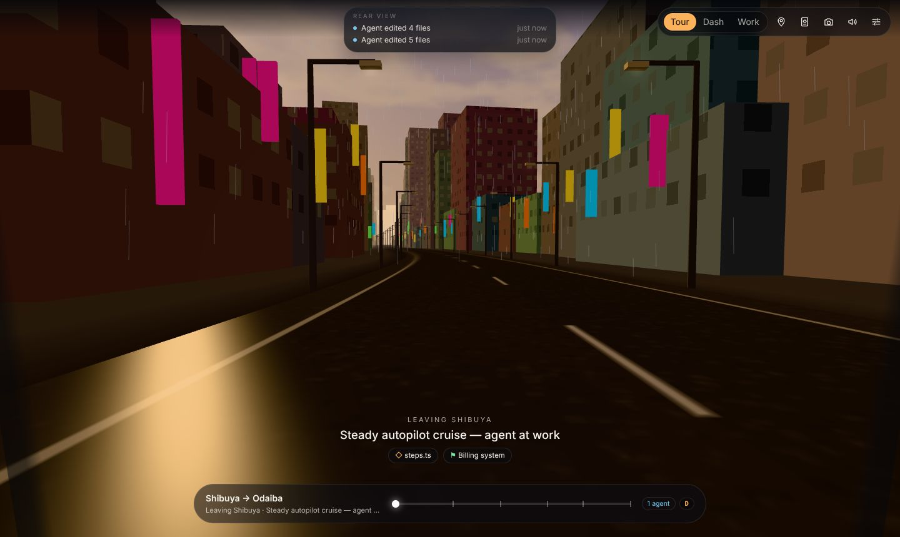
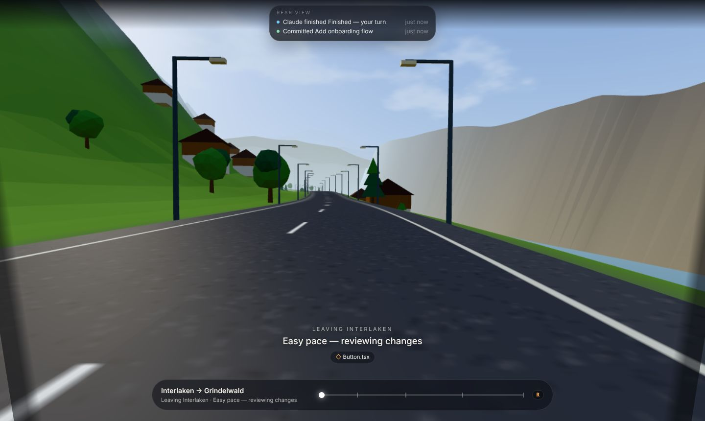
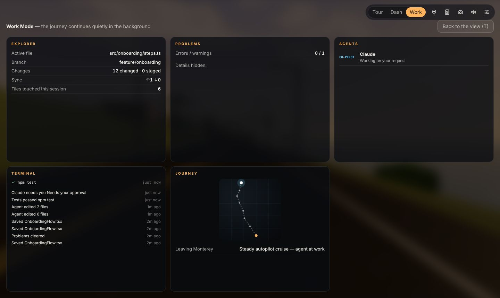

# VibeTour

**See the world while you code.** VibeTour turns a coding session into a journey. While you write code, run tests and supervise coding agents, you travel through a destination of your choice: the California coast at golden hour, Tokyo in the rain, an Alpine valley, Tuscan vineyards. The car's instruments show what is actually happening in your project.



This repository builds the V0/V1 product from the [PRD](vibetour-PRD):

- a **VS Code extension** (also works in VS Code forks such as Cursor and Windsurf)
- a **Companion Display** for a second screen
- a **standalone companion** for any editor or terminal agent

All three share one procedural Three.js renderer and one activity/journey engine.

| Dashboard Mode | Tour Mode (Tokyo Rain) |
| --- | --- |
|  |  |
| **Tour Mode (Swiss Alps)** | **Work Mode** |
|  |  |

## What it does

- **Travel first.** Seven procedurally rendered *Journey Packs*:
  - California Coast (Monterey → Big Sur)
  - Tokyo After Dark (Shibuya → Odaiba)
  - Swiss Alpine Morning (Interlaken → Grindelwald)
  - Tuscany Golden Hour (Florence → Siena)
  - Iceland South Coast (Seljalandsfoss → Vík)
  - Scottish Highlands (Glencoe → Eilean Donan)
  - Mars Colony Drive (a clearly labelled fantasy journey)

  Each pack has its own scenery, landmarks (Bixby Creek Bridge, Tokyo Tower, the Rainbow Bridge, Torre del Mangia, Eilean Donan…), time-of-day and weather variants, and a branching scene graph, so the same trip plays out a little differently each time.
- **Movement represents useful activity, not keystrokes.** An Activity Engine normalises IDE, Git, terminal, task and agent events into the PRD's states (`IDLE`, `THINKING`, `ACTIVE`, `AGENT_ACTIVE`, `VERIFYING`, `WAITING_FOR_USER`, `WARNING`, `BLOCKED`, `COMPLETE`). Calm motion rules follow from those states:

  | What's happening | What the car does |
  | --- | --- |
  | Thinking | Gentle cruising |
  | Tests running | You enter a tunnel or a coastal rock shed |
  | Tests pass | The road opens up |
  | Your agent asks for approval | A scenic stop |
  | A failing build left alone | You pull over safely |
  | Long idle | You park somewhere nice |

- **Arrival has meaning.** Progress follows productive time and holds at the final approach until you mark the objective complete. Then you arrive, the sun sets, and your **Passport** gets a stamp.
- **Information becomes instruments** (PRD §8):

  | Instrument | Shows |
  | --- | --- |
  | Speedometer | Development activity |
  | Tachometer | Agent and tool activity |
  | Fuel | Journey, agent context or laptop battery |
  | Temperature | Warnings and errors |
  | Check-engine light | Failing builds or tests |
  | Rear-view mirror | Recent activity and your Git timeline |
  | Side mirrors | Background (crew) agents |
  | Radio | Your AI agents |
  | Console | Running commands |
  | Glovebox | Project docs |
  | Gear selector | P / R / N / D |

- **Coding remains primary.** `Ctrl+Alt+V` (`⌘⌥V`) toggles between the tour and your full IDE. Every immersive action has a command-palette equivalent, and Work Mode hides the view and drops rendering to a trickle.
- **Opening experience.** "Where do you want to go today?", boarding-pass tickets, *Take me somewhere* (mood + duration), saved tickets, ticket stubs, favourites, and travel memories ("You last visited Big Sur while building Atlas — Return to Big Sur").
- **Capture my workplace.** One keystroke makes a share card ("Coding near Bixby Creek Bridge this evening."). File names never appear in it, and the project name is opt-in.
- **Accessible and light.**
  - Comfort: reduced motion, static scenery (a rotating series of scenic stops, no simulated motion), no camera movement, no weather.
  - Display: high contrast, UI scale, full keyboard control and screen-reader announcements.
  - Performance: 30/60 FPS, low-GPU mode, automatic GPU throttling, and no rendering while hidden.
  - Sound: a procedural soundscape (engine, road, wind, rain, ambience, generative Focus Mix) with independent volumes.
- **Private by design.** VibeTour reads metadata only (event types, file names, counts, exit codes), never source code. Nothing leaves your machine. Streaming Mode removes file names, paths, branches, commands and messages at the source.

## Try it

You need Node.js 18 or later.

```bash
npm install
npm run demo          # browser demo with a simulated coding session → http://127.0.0.1:5177/
```

The demo runs the real engine with a scripted session that follows the PRD's core story: you code, Claude edits files, tests run in a tunnel, the agent asks a question at a scenic stop, and you commit. Open **Demo controls** (top left) to trigger events yourself. Add `?speed=20` to the URL to fast-forward time.

### VS Code extension

```bash
npm run package       # builds dist/ and writes vibetour-<version>.vsix
code --install-extension vibetour-0.1.0.vsix
```

Then run **VibeTour: Open Tour** or press `Ctrl+Alt+V` / `⌘⌥V`.

| Command | |
| --- | --- |
| VibeTour: Open Tour / Toggle Tour ↔ Work (`Ctrl+Alt+V`) | The signature switch between the view and your IDE |
| VibeTour: Where Do You Want to Go Today? / Take Me Somewhere | Quick-pick equivalents of the destination board |
| VibeTour: Arrive — Objective Complete / Set Journey Objective | Earn your arrival |
| VibeTour: Park (End Session) / Resume Journey / End Journey | Multi-session road trips persist per project |
| VibeTour: Cycle Display Mode | Tour → Dashboard → Work |
| VibeTour: Open Companion Display / Copy Companion Display URL | Second-screen display |
| VibeTour: Open Glovebox | Project docs |
| VibeTour: Show Passport / Capture My Workplace | Passport stamps and share cards |
| VibeTour: Toggle Streaming Mode | Hide private details everywhere |
| VibeTour: Copy Claude Code Hook Configuration | Agent integration (see below) |

Inside the view: `T` `D` `W` switch modes, `G` destinations, `P` passport, `C` capture, `M` sound, `S` settings, `A` arrive, `?` help.

**Settings:**

| Setting | Controls |
| --- | --- |
| `vibetour.companion.enabled`, `vibetour.companion.port` | Companion Display server |
| `vibetour.privacy.streamingMode` | Streaming Mode |
| `vibetour.journey.autoResume` | Auto-resume after VS Code restarts |
| `vibetour.tour.openBeside` | Open the tour beside the editor |
| `vibetour.statusBar.enabled` | Status bar item |
| `vibetour.agents.detectExternalEdits` | Treat files changed outside the editor as agent activity |

### Companion Display (second screen)

The extension runs a small server bound to `127.0.0.1`. Every request needs a per-install token, and Host and Origin headers are checked against DNS rebinding. Run **VibeTour: Open Companion Display** and drag the browser window to another monitor, tablet or ultrawide side panel. Each display keeps its own mode and preferences.

### Any editor / terminal agents

```bash
npm run build
node dist/cli.js ~/code/my-project --pack tokyo-night      # or: npm link && vibetour ~/code/my-project
```

The standalone companion:

- watches the folder (it ignores `node_modules`, build output and `.git`)
- polls Git for branch, changes and commits
- accepts agent hook events
- opens the display in your browser

Run `node dist/cli.js --help` for options (`--port`, `--no-open`, `--scope`, `--streaming`).

### Claude Code (and other agents)

VibeTour shows your agents in the cockpit. The main agent is your co-pilot on the radio, and sub-agents appear in the side mirrors as crew. When an agent waits for approval, the car pulls into a scenic stop. Run **VibeTour: Copy Claude Code Hook Configuration** and paste the result into `.claude/settings.json`, or see [docs/agent-integration.md](docs/agent-integration.md) for the hook forwarder, Codex `notify`, and the provider-neutral HTTP API.

## Development

```bash
npm run typecheck     # tsc, strict
npm test              # vitest unit tests: engine, packs, server, hooks, classifiers, CLI helpers
npm run build         # esbuild: dist/extension.js, dist/cli.js, dist/webview/*
npx playwright test   # end-to-end: browser demo + standalone companion (headless Chromium, software WebGL)
npm run watch         # rebuild on change
```

| Path | What |
| --- | --- |
| `src/core/` | Host-agnostic engine: event model, Activity Engine, motion rules, Journey Engine, Journey Pack schema/validation, passport, session, protocol |
| `src/webview/` | Browser app: Three.js tour renderer (`renderer/`), cockpit and overlays (`ui/`), soundscape, transports, demo host |
| `src/extension/` | VS Code host: IDE and Git adapters, tour panel, status bar, commands |
| `src/server/`, `src/host/` | Companion Display server, session file, shared HTML/CSP, Git parsing, file stores |
| `src/cli/` | Standalone companion |
| `bin/vibetour-hook.js` | Dependency-free agent hook forwarder |
| `packs/<id>/manifest.json` | Built-in Journey Packs |

See [docs/architecture.md](docs/architecture.md) for how the pieces fit together, and [docs/journey-packs.md](docs/journey-packs.md) for authoring packs.

## Status against the PRD

**Done — V0 (§18):**

- cockpit and route
- day/night
- road movement
- VS Code connection
- coding, agent and activity detection
- active file, Git and diagnostics indicators
- journey progress
- Tour, Work and Companion modes

**Done — V1 (§19):**

- destination picker and seven tours
- weather and day/night variants
- journey lengths and persistent routes
- keyboard shortcuts
- terminal, AI and file panels
- Git and test integration
- journey statistics
- share cards

**Done — other PRD features:**

- Passport, ticket stubs and travel memories
- *Take me somewhere*
- Match my clock
- Streaming Mode
- accessibility and performance controls

**Not yet built (V2 and later):**

- aircraft and other travel modes
- real landmark routes from map data
- footage-based packs, the BYOK Journey Generator and Journey Studio
- marketplace and payments (tickets are free and "Included" today)
- gifting, team expeditions and the journey calendar
- live weather
- configurable dashboard widgets

The Journey Pack manifest already follows the PRD §39 layout, so footage-based or generated packs can be added without changing the engine.
